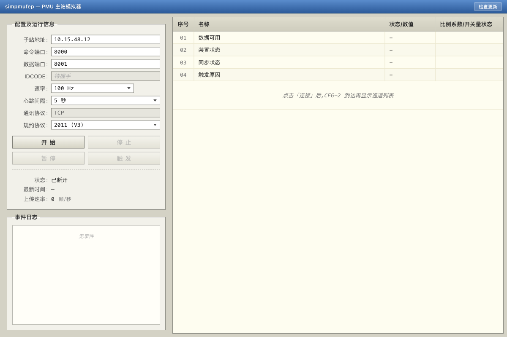

<div align="center">

# 📡 PmuSim

**Cross-platform PMU master-station simulator — one desktop tool for Q/GDW 131-2006 (V2) and GB/T 26865.2-2011 (V3).**

[](https://github.com/Karl-Dai/PmuSim/releases)
[](https://github.com/Karl-Dai/PmuSim/releases)
[](https://github.com/Karl-Dai/PmuSim/stargazers)
[](LICENSE)
[]()

Built with **Rust** · **Tauri 2** · **Vue 3**

**English** · [中文](README_CN.md)



</div>

---

## Why this project

Testing a PMU master is usually one of two pains: borrow a real substation, or run a half-broken Python script that only speaks one protocol revision. PmuSim puts a full master on your desktop:

- 📡 **Two protocol revisions in one binary** — Q/GDW 131-2006 (V2) and GB/T 26865.2-2011 (V3), with the wire-format and port quirks they each demand.
- 🤝 **Correct TCP roles** — mgmt pipe master-as-client, V3 data pipe master-as-client too (per spec), V2 data pipe master-as-server. No more re-explaining direction in every PR.
- ⚡ **One-click handshake** — `Request CFG-1 → Send CFG-2 Command → Send CFG-2 → Request CFG-2 → Open Data` automated end-to-end.
- 🔄 **In-app auto-update** — ed25519-signed bundles via GitHub Releases, with a 4-way endpoint fallback (3 China proxies + GitHub) so mainland users still pick up updates when the direct link is blocked.
- 🪶 **Small native binary** — Rust + Tauri 2; no JVM, no Python runtime, no Electron.

## Table of Contents

- [Screenshots](#screenshots)
- [Features](#features)
- [Download](#download)
- [Quick Start](#quick-start)
- [Build from Source](#build-from-source)
- [Protocol Support](#protocol-support)
- [Architecture](#architecture)
- [Changelog](#changelog)
- [macOS First Launch](#macos-first-launch)
- [License](#license)

## Screenshots

**Main window · single-substation `simpmufep`-style layout**

The left pane holds the connection form and the event log; the right pane is the live data table with CFG-2 channel names mapped onto each row. The title bar carries a "检查更新" button that talks to the in-app updater.


## Features

### 📡 Protocol

- **V2 (Q/GDW 131-2006)** — 2-byte IDCODE, header order `SYNC-SIZE-SOC-IDCODE`, 4-bit time-quality.
- **V3 (GB/T 26865.2-2011)** — 8-byte ASCII IDCODE, header order `SYNC-SIZE-IDCODE-SOC`, 8-bit time-quality, IDCODE present in data frames.
- **CRC-CCITT** (`poly=0x1021`, `init=0x0000`) with V2/V3 round-trip tests.
- **GBK channel names** decoded via `encoding_rs` — Chinese substation names land in the table unmangled.

### 🌐 Networking

- **Correct direction per spec** — V2: master is TCP server on the data port; V3: master is TCP client on the data port (master-outbound). UI hides the irrelevant field per protocol.
- **Independent mgmt / data ports** — port fields are split with auto-follow + dirty tracking so users typing one port don't silently desync the other.
- **Full handshake** — `Request CFG-1 → Send CFG-2 Command → Send CFG-2 → Request CFG-2 → Open Data`, also exposed as a single "auto handshake" button.
- **Heartbeat** — configurable interval, live-update without reconnect, debounced so holding ↑/↓ on the dropdown doesn't fire one command per tick.

### 🖥️ UI

- `simpmufep`-style single-substation layout (Vue 3 + TypeScript + Vite, ~95 KB gzipped).
- Live event log with copy / clear; raw hex on demand.
- Real-time data table with CFG-2 channel names + analog scale factors + digital mask labels.
- Bilingual error toasts (UI Chinese, error messages preserve upstream `PmuError` strings).

### 🔄 Updates

- **Auto-update on startup** (silent), throttled to one check per 6 h.
- **Manual "检查更新"** button bypasses throttle + snooze.
- **24 h snooze** per version when the user clicks *稍后*.
- **ed25519-signed bundles** verified by `tauri-plugin-updater` before install.
- **4-way endpoint fallback**: `ghfast.top` / `gh-proxy.com` / `gh.idayer.com` → GitHub.

## Download

Pre-built installers for every platform are on the **[Releases page](https://github.com/Karl-Dai/PmuSim/releases)**. Every binary is minisign-signed and verified by the in-app updater before install.

| Platform | Installer |
|----------|-----------|
| Windows  | x64: `PmuSim_<ver>_x64-setup.exe` (NSIS) · `PmuSim_<ver>_x64_en-US.msi` — ARM64: `PmuSim_<ver>_arm64-setup.exe` (NSIS) |
| macOS    | `PmuSim_<ver>_aarch64.dmg` (Apple Silicon) · `PmuSim_<ver>_x64.dmg` (Intel) |
| Linux    | `PmuSim_<ver>_amd64.AppImage` · `PmuSim_<ver>_amd64.deb` · `PmuSim-<ver>-1.x86_64.rpm` |

Auto-update is enabled from v0.3.0 onward. Users on older builds need to install v0.3.0+ manually once; the in-app updater takes over afterwards. macOS users need [one extra step on first launch](#macos-first-launch).

### China mirror

Users in mainland China may have unstable access to GitHub Releases. Recommended mirror for direct installer downloads:

- <https://ghfast.top/https://github.com/Karl-Dai/PmuSim/releases/latest>

Starting from v0.3.0, the in-app updater automatically falls back through multiple proxies — no manual action needed. However, **the very first upgrade from an older version** uses the endpoint compiled into the old binary (which had no updater at all); install v0.3.0 once via the mirror above, after which the updater will route through proxies automatically.

## Quick Start

1. **Launch PmuSim** and pick a protocol (V2 / V3). The default `10.15.48.12 : 8000` (V3 mgmt port) is editable.
2. Click **开始** — the master starts listening (V2) or stays idle (V3 until you "Connect"); then **连接** to handshake with the substation.
3. CFG-1 / CFG-2 round-trip lands the IDCODE in the readonly field; the data table fills in once *Open Data* succeeds.
4. Use **暂停 / 触发** to suspend/resume the data stream or fire a one-shot trigger frame.

## Build from Source

### Prerequisites

- [Rust](https://rustup.rs/) 1.77+
- [Node.js](https://nodejs.org/) 18+
- [Tauri CLI](https://tauri.app/) — `cargo install tauri-cli --version '^2'`
- OS-level deps: see [Tauri 2 prerequisites](https://v2.tauri.app/start/prerequisites/)

### Steps

```bash
# install frontend deps (one-time)
cd frontend && npm install

# run in dev mode
cd ../crates/pmusim-app && cargo tauri dev

# production build (Tauri invokes the frontend build automatically)
cargo tauri build
```

`cargo test --workspace` runs the core protocol tests (frame parser, CRC, time-utils round-trip).

## Protocol Support

### Frame Types

| SYNC   | Frame Type | Direction                          |
|--------|------------|------------------------------------|
| 0xAA0x | Data       | Substation → Master (data pipe)   |
| 0xAA2x | CFG-1      | Substation → Master (mgmt pipe)   |
| 0xAA3x | CFG-2      | Bidirectional (mgmt pipe)         |
| 0xAA4x | Command    | Master → Substation (mgmt pipe)   |

### Commands

| Code   | Command          | Description                                |
|--------|------------------|--------------------------------------------|
| 0x0001 | Close Data       | Stop real-time data stream                 |
| 0x0002 | Open Data        | Start real-time data stream                |
| 0x0004 | Send CFG-1       | Request configuration frame 1              |
| 0x0005 | Send CFG-2       | Request configuration frame 2              |
| 0x4000 | Heartbeat        | Keep-alive heartbeat                       |
| 0x8000 | Send CFG-2 Cmd   | Notify substation before sending CFG-2     |

### Connection Model

| Pipe       | Master TCP Role (V2) | Master TCP Role (V3) | V2 Port | V3 Port |
|------------|----------------------|----------------------|---------|---------|
| Management | Client               | Client               | 7000    | 8000    |
| Data       | Server               | Client (outbound)    | 7001    | 8001    |

### V2 vs V3

| Feature             | V2 (2006)            | V3 (2011)              |
|---------------------|----------------------|------------------------|
| Management port     | 7000                 | 8000                   |
| Data port           | 7001                 | 8001                   |
| IDCODE length       | 2 bytes              | 8 bytes (ASCII)        |
| Header field order  | SYNC-SIZE-SOC-IDCODE | SYNC-SIZE-IDCODE-SOC   |
| Data frame IDCODE   | Not present          | Present                |
| Time quality        | 4-bit                | 8-bit                  |
| Data pipe direction | Master = Server      | Master = Client        |

## Architecture

```
PmuSim/
├── crates/
│   ├── pmusim-core/      # Protocol library (no Tauri dependency)
│   ├── pmusim-app/       # Tauri desktop application (master station)
│   └── pmusim-sub/       # Tauri desktop application (substation simulator)
├── frontend/             # Vue 3 + TypeScript SPA (master)
├── frontend-sub/         # Vue 3 + TypeScript SPA (substation)
├── scripts/              # Release scripts (updater manifest, release notes)
└── .github/workflows/    # CI: release.yml (sign + publish)
```

| Layer    | Stack                                                    |
|----------|----------------------------------------------------------|
| Backend  | Rust, [tokio](https://tokio.rs/) (async TCP), `encoding_rs` (GBK)  |
| Frontend | Vue 3, TypeScript, Vite                                   |
| Desktop  | [Tauri 2](https://tauri.app/) + `tauri-plugin-updater`    |

## Substation simulator (`pmusim-sub`)

`pmusim-sub` is a standalone Tauri app that plays the PMU **data-sender** role — the counterpart to the PmuSim master. Use it to develop or test the master without needing a real substation.

**Protocol support** — V2 (Q/GDW 131-2006) and V3 (GB/T 26865.2-2011), with full command-response handshake: responds to CFG-1 / CFG-2 requests, accepts the Send-CFG-2 command, obeys Open/Close Data, heartbeat, and trigger frames.

**Data generation** — configurable sine-phasor output per channel: magnitude, phase angle, system frequency offset Δf, and ROCOF. Static analog and digital values are also settable.

**TCP roles (mirror of the master)**

| Pipe       | Substation TCP Role (V2) | Substation TCP Role (V3) | Default Port |
|------------|--------------------------|--------------------------|--------------|
| Management | Server                   | Server                   | V2 7000 / V3 8000 |
| Data       | Client (dials master)    | Server (master dials in) | V2 7001 / V3 8001 |

**Run from source** (no signed installer / auto-updater in this version):

```bash
cd frontend-sub && npm install   # one-time frontend deps
cd ../crates/pmusim-sub && cargo tauri dev
```

**Local interop test** — start `pmusim-sub` first, then launch the PmuSim master and point it at the substation:

- **V3**: master mgmt target → `127.0.0.1 : 8000`
- **V2**: master mgmt target → `127.0.0.1 : 7000`; master data-listen port → `7001`

## Changelog

See [CHANGELOG.md](CHANGELOG.md) for the full version history, or the [Releases page](https://github.com/Karl-Dai/PmuSim/releases) for signed installers and updater manifests.

Auto-update is enabled from v0.3.0. Users on v0.1.0 / v0.2.0 must install v0.3.0+ manually once; the in-app updater takes over from there.

## macOS First Launch

The bundles are **not Apple-notarized** (no paid Developer Program). On first launch macOS shows *"PmuSim cannot be opened — Apple could not verify…"* with only *Done* and *Move to Trash* buttons. This is the standard macOS 15 (Sequoia) block for ad-hoc-signed apps — the app is **not damaged**.

<details>
<summary><b>How to allow it (pick one)</b></summary>

**1. GUI path**

- Double-click the `.app`, see the block dialog, click *Done*.
- Open *System Settings → Privacy & Security*, scroll to the bottom.
- You'll see *"PmuSim was blocked…"* — click *Open Anyway* and enter your password.
- The next dialog has an *Open* button; click it. Subsequent launches go straight through.

**2. One-line Terminal**

```bash
xattr -dr com.apple.quarantine "/Applications/PmuSim.app"
```

Strips the quarantine flag so macOS stops blocking.

</details>

## License

[MIT](LICENSE)
