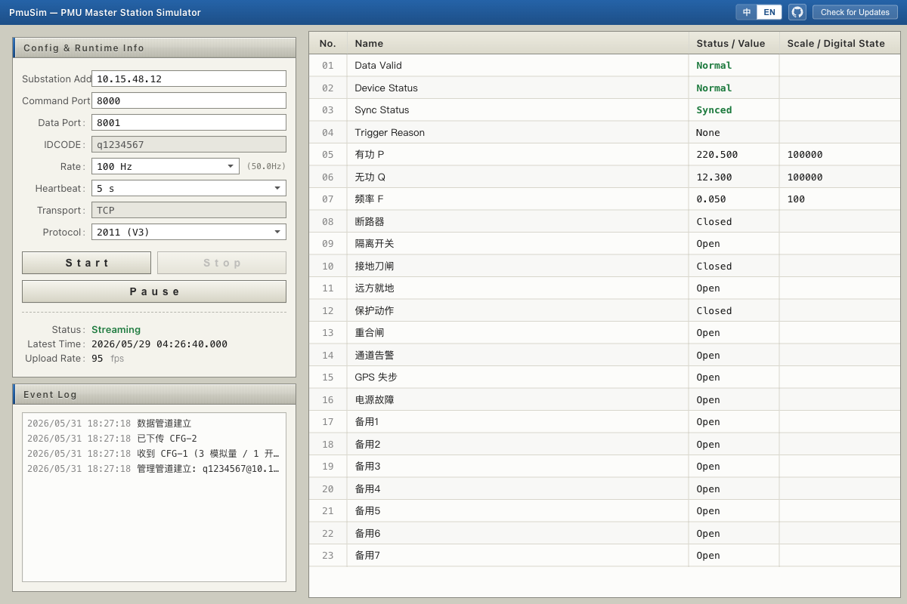
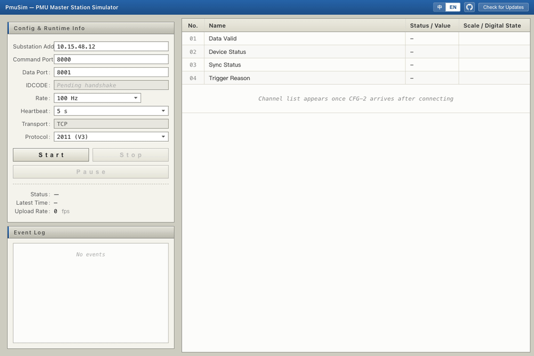
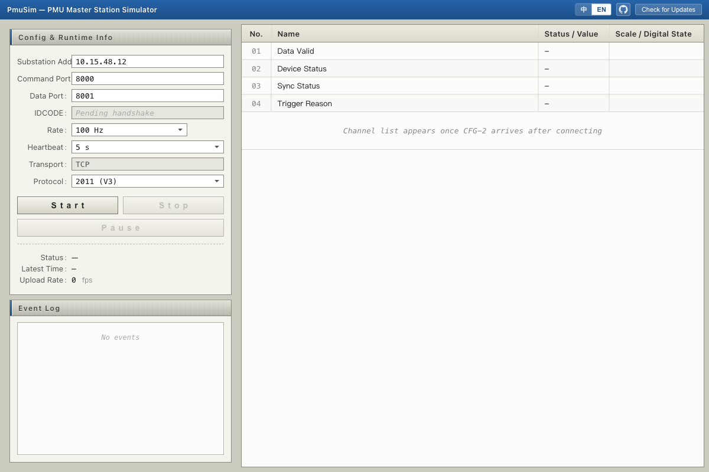
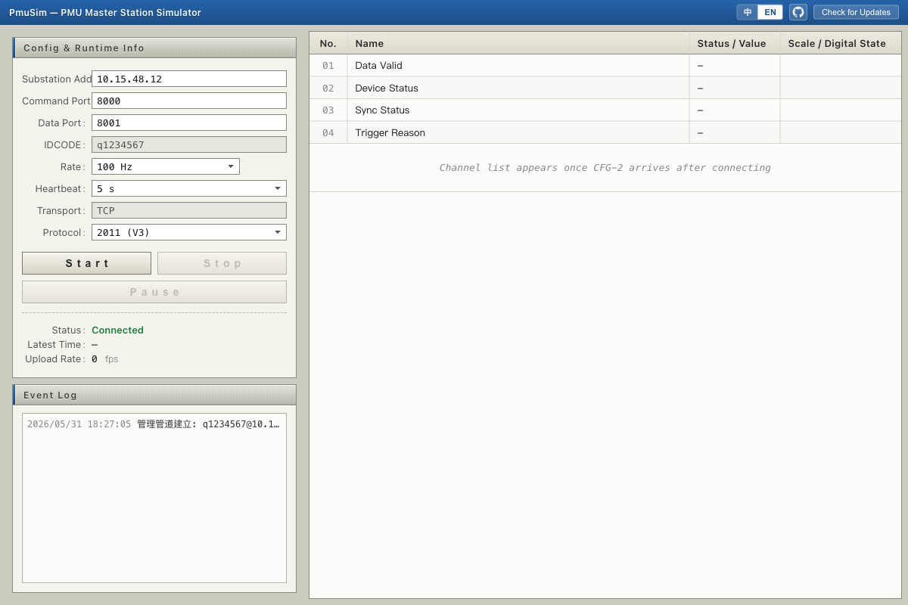

<div align="center">


[](https://github.com/Karl-Dai/PmuSim/releases)
[](https://github.com/Karl-Dai/PmuSim/releases)
[](https://github.com/Karl-Dai/PmuSim/stargazers)
[](LICENSE)
[]()

**Cross-platform PMU master-station simulator — one desktop tool for Q/GDW 131-2006 (V2) and GB/T 26865.2-2011 (V3).**

Built with **Rust** · **Tauri 2** · **Vue 3** — **English** · [中文](README_CN.md)



</div>

---

## See it run



Idle → **连接中 (connecting)** → **已连接 (connected)** → live data streaming. The status pill stays amber while the TCP socket is up but the substation hasn't replied with CFG-1; it only turns green once a real PMU frame arrives.

## Why this project

Testing a PMU master is usually one of two pains: borrow a real substation, or run a half-broken script that speaks only one protocol revision. PmuSim puts a full master on your desktop:

- 📡 **Two protocol revisions, one binary** — Q/GDW 131-2006 (V2) and GB/T 26865.2-2011 (V3), wire-format and port quirks included.
- 🤝 **Correct TCP roles per spec** — mgmt pipe master-as-client; V3 data pipe master-as-client; V2 data pipe master-as-server.
- 🌐 **Multi-substation at once** — the master accepts several substations simultaneously; a side panel lists each by IDCODE / FPS / status LED, click to focus, and commLog / config / data frames / frame-rate / clock-offset / reconnect are all keyed per-substation.
- 🧭 **Phasor visualization** — a polar phasor plot embedded in the data panel decodes each channel per the CFG-2 FORMAT bit (polar vs rectangular) and draws magnitude + angle live; the data table gains system frequency, ROCOF and per-phasor rows.
- ⚡ **One-click handshake** — `CFG-1 → CFG-2 command → CFG-2 → Request CFG-2 → Open Data`, automated end-to-end with ACK/NACK waits.
- 🚨 **Frame anomaly monitor** — timestamp anomalies (backward / gap / stall) are split out of the event log into a dedicated bottom panel with per-type/station filters, count badges, CSV export and expandable row details.
- 🔁 **Auto-reconnect** — when the master dials a substation as a client and the link drops, each target retries independently with exponential backoff; no manual reconnect.
- ⏱️ **Clock-offset readout** — a live offset between each data frame's SOC/FRACSEC and the local wall clock surfaces substation time drift at a glance.
- 🔄 **In-app auto-update** — ed25519-signed bundles, 4-way endpoint fallback (3 China proxies + GitHub).
- 🪶 **Small native binary** — Rust + Tauri 2; no JVM, no Python runtime, no Electron.

## Quick Start

1. **Pick a protocol (V2 / V3).** The default target `10.15.48.12 : 8000` is editable.
   <br>
2. **Set the substation address and ports.** The data port auto-follows the command port (editable).
   <br>
3. **Click 开始 then 连接.** Status goes 连接中 → 已连接 once the substation replies; the IDCODE lands in the readonly field.
   <br>
4. **Watch the data table fill** with CFG-2 channel names, analog scale factors, and digital labels; 上传速率 shows live fps.
   <br>

## Download

Pre-built installers for every platform are on the **[Releases page](https://github.com/Karl-Dai/PmuSim/releases)**. Every binary is minisign-signed and verified by the in-app updater before install.

| Platform | Installer |
|----------|-----------|
| Windows  | x64: `PmuSim_<ver>_x64-setup.exe` (NSIS) · `PmuSim_<ver>_x64_en-US.msi` — ARM64: `PmuSim_<ver>_arm64-setup.exe` (NSIS) |
| macOS    | `PmuSim_<ver>_aarch64.dmg` (Apple Silicon) · `PmuSim_<ver>_x64.dmg` (Intel) |
| Linux    | `PmuSim_<ver>_amd64.AppImage` · `PmuSim_<ver>_amd64.deb` · `PmuSim-<ver>-1.x86_64.rpm` |

Auto-update is enabled from v0.3.0 onward; older builds install v0.3.0+ once, then the updater takes over. macOS users need [one extra step on first launch](#macos-first-launch).

**China mirror** (mainland GitHub access can be unstable): <https://ghfast.top/https://github.com/Karl-Dai/PmuSim/releases/latest>. From v0.3.0 the in-app updater auto-falls-back through proxies; the *first* upgrade from a pre-updater build must be installed once via the mirror.

## Build from Source

Prereqs: [Rust](https://rustup.rs/) 1.77+, [Node.js](https://nodejs.org/) 18+, Tauri CLI (`cargo install tauri-cli --version '^2'`), and the [Tauri 2 OS deps](https://v2.tauri.app/start/prerequisites/).

```bash
cd frontend && npm install          # one-time
cd ../crates/pmusim-app && cargo tauri dev   # dev
cargo tauri build                    # production bundle
```

`cargo test --workspace` runs the core protocol tests (frame parser, CRC, time-utils round-trip).

## Protocol Support

<details>
<summary><b>Frame types, commands, connection model, V2 vs V3</b></summary>

### Frame Types

| SYNC   | Frame Type | Direction                        |
|--------|------------|----------------------------------|
| 0xAA0x | Data       | Substation → Master (data pipe)  |
| 0xAA2x | CFG-1      | Substation → Master (mgmt pipe)  |
| 0xAA3x | CFG-2      | Bidirectional (mgmt pipe)        |
| 0xAA4x | Command    | Master → Substation (mgmt pipe)  |

### Commands

| Code   | Command        | Description                            |
|--------|----------------|----------------------------------------|
| 0x0001 | Close Data     | Stop real-time data stream             |
| 0x0002 | Open Data      | Start real-time data stream            |
| 0x0004 | Send CFG-1     | Request configuration frame 1          |
| 0x0005 | Send CFG-2     | Request configuration frame 2          |
| 0x4000 | Heartbeat      | Keep-alive heartbeat                   |
| 0x8000 | Send CFG-2 Cmd | Notify substation before sending CFG-2 |

### Connection Model

| Pipe       | Master Role (V2) | Master Role (V3) | V2 Port | V3 Port |
|------------|------------------|------------------|---------|---------|
| Management | Client           | Client           | 7000    | 8000    |
| Data       | Server           | Client (outbound)| 7001    | 8001    |

### V2 vs V3

| Feature             | V2 (2006)            | V3 (2011)            |
|---------------------|----------------------|----------------------|
| Management port     | 7000                 | 8000                 |
| Data port           | 7001                 | 8001                 |
| IDCODE length       | 2 bytes              | 8 bytes (ASCII)      |
| Header field order  | SYNC-SIZE-SOC-IDCODE | SYNC-SIZE-IDCODE-SOC |
| Data frame IDCODE   | Not present          | Present              |
| Time quality        | 4-bit                | 8-bit                |
| Data pipe direction | Master = Server      | Master = Client      |

</details>

## Architecture

```
PmuSim/
├── crates/
│   ├── pmusim-core/      # Protocol library (no Tauri dependency)
│   ├── pmusim-app/       # Tauri desktop application (master station)
│   └── pmusim-sub/       # Tauri desktop application (substation simulator)
├── frontend/             # Vue 3 + TypeScript SPA (master)
├── frontend-sub/         # Vue 3 + TypeScript SPA (substation)
├── scripts/              # Release scripts (updater manifest, release notes)
└── .github/workflows/    # CI: release.yml (sign + publish)
```

| Layer    | Stack                                                            |
|----------|------------------------------------------------------------------|
| Backend  | Rust, [tokio](https://tokio.rs/) (async TCP), `encoding_rs` (GBK) |
| Frontend | Vue 3, TypeScript, Vite                                          |
| Desktop  | [Tauri 2](https://tauri.app/) + `tauri-plugin-updater`           |

## FAQ / Troubleshooting

<details>
<summary><b>Status shows 已连接 but the data table stays empty / 上传速率 is 0</b></summary>

The status pill distinguishes two states: **连接中 (connecting)** means the TCP socket is open but the substation hasn't returned CFG-1 yet; **已连接 (connected)** means a real PMU frame has arrived. If you see 连接中 (amber) plus an event-log line like `CFG-1 not received after request`, the command port accepted the TCP connection but nothing is speaking the PMU protocol behind it — check that the substation's command service is actually running on that port.
</details>

<details>
<summary><b>macOS: "PmuSim cannot be opened — Apple could not verify…"</b></summary>

The bundles are ad-hoc-signed (not notarized). See [macOS First Launch](#macos-first-launch) for the one-time allow step.
</details>

<details>
<summary><b>GitHub downloads are slow or blocked (mainland China)</b></summary>

Use the China mirror in [Download](#download); the in-app updater also auto-falls-back through proxies from v0.3.0.
</details>

<details>
<summary><b>Which side binds the data port?</b></summary>

V2: the master is the data-pipe **server** and binds the local listen port (command port + 1 by default). V3: the master is a **client** and dials out to the substation's remote data port. The UI labels the field accordingly and hides the irrelevant one per protocol.
</details>

## Roadmap

V3 spec-conformance items from `docs/TODO.md` are all shipped: FORMAT-flag decoding (float / rectangular), multi-PMU config frames, CFG-2 ACK/NACK waits, heartbeat-timeout hardening, STAT bit10 config-change re-handshake, ANUNIT type-byte masking, GPS time-quality decode, off-lock-safe IDCODE bytes, and OpenData state-gating. Remaining: the lab substation's data source (IEMP pipeline) currently emits all-zero samples — a substation-side concern, tracked in `docs/TODO.md`. New ideas and field reports are welcome via issues.

## Contributing

1. Open an issue describing the bug/feature before a large PR.
2. Branch from `main`; keep PRs focused.
3. Before opening a PR, run `cargo test --workspace` and `cd frontend && npm run build` — both must pass.
4. **Commit authorship:** all commits must be authored `Karl-Dai Karl <kelsoprotein@gmail.com>` with **no** AI co-author or generated-signature trailer lines.

## Substation simulator (`pmusim-sub`)

`pmusim-sub` is a standalone Tauri app that plays the PMU **data-sender** role — the counterpart to the PmuSim master. Use it to develop or test the master without needing a real substation.

**Protocol support** — V2 (Q/GDW 131-2006) and V3 (GB/T 26865.2-2011), with full command-response handshake: responds to CFG-1 / CFG-2 requests, accepts the Send-CFG-2 command, obeys Open/Close Data, heartbeat, and trigger frames.

**Data generation** — configurable sine-phasor output per channel: magnitude, phase angle, system frequency offset Δf, and ROCOF. Static analog and digital values are also settable.

**TCP roles (mirror of the master)**

| Pipe       | Substation TCP Role (V2) | Substation TCP Role (V3) | Default Port |
|------------|--------------------------|--------------------------|--------------|
| Management | Server                   | Server                   | V2 7000 / V3 8000 |
| Data       | Client (dials master)    | Server (master dials in) | V2 7001 / V3 8001 |

**Run from source** (no signed installer / auto-updater in this version):

```bash
cd frontend-sub && npm install   # one-time frontend deps
cd ../crates/pmusim-sub && cargo tauri dev
```

**Local interop test** — start `pmusim-sub` first, then launch the PmuSim master and point it at the substation:

- **V3**: master mgmt target → `127.0.0.1 : 8000`
- **V2**: master mgmt target → `127.0.0.1 : 7000`; master data-listen port → `7001`

## macOS First Launch

The bundles are **not Apple-notarized** (no paid Developer Program). On first launch macOS shows *"PmuSim cannot be opened — Apple could not verify…"* — the app is **not damaged**, this is the standard macOS block for ad-hoc-signed apps.

<details>
<summary><b>How to allow it (pick one)</b></summary>

**1. GUI path** — double-click the `.app`, click *Done*; open *System Settings → Privacy & Security*, scroll down, click *Open Anyway*, enter your password; click *Open* on the next dialog. Subsequent launches go straight through.

**2. One-line Terminal**

```bash
xattr -dr com.apple.quarantine "/Applications/PmuSim.app"
```

</details>

## Changelog

See [CHANGELOG.md](CHANGELOG.md) for the full version history, or the [Releases](https://github.com/Karl-Dai/PmuSim/releases) page for downloads.

## Acknowledgments

Built on [Tauri 2](https://tauri.app/), [Vue 3](https://vuejs.org/), [tokio](https://tokio.rs/), [`encoding_rs`](https://github.com/hsivonen/encoding_rs), and `tauri-plugin-updater`. Protocol behavior follows the GB/T 26865.2-2011 (V3) and Q/GDW 131-2006 (V2) specifications.

## License

[MIT](LICENSE)
