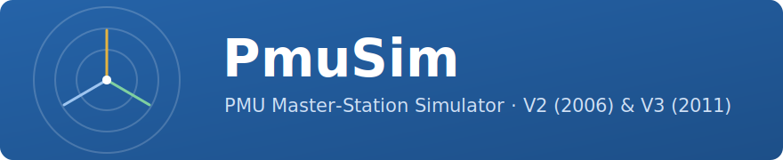
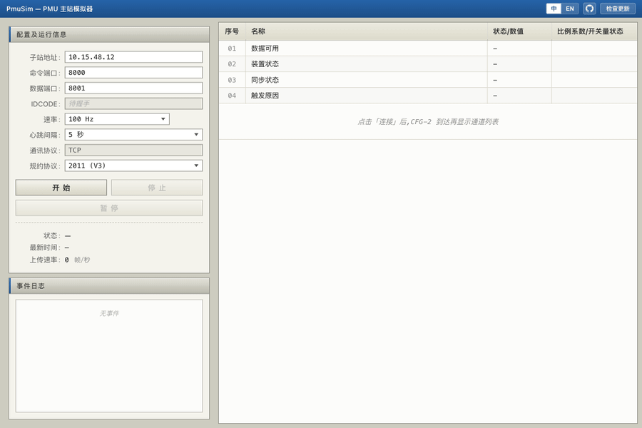
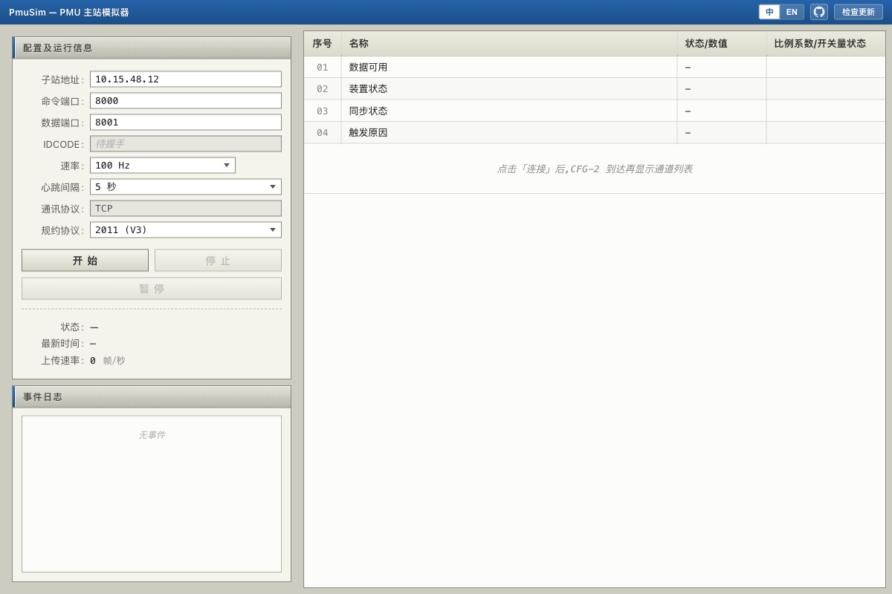
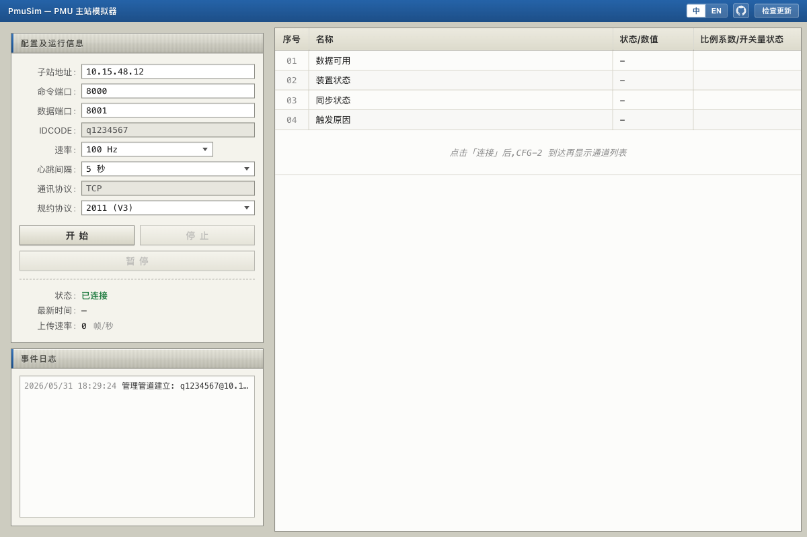
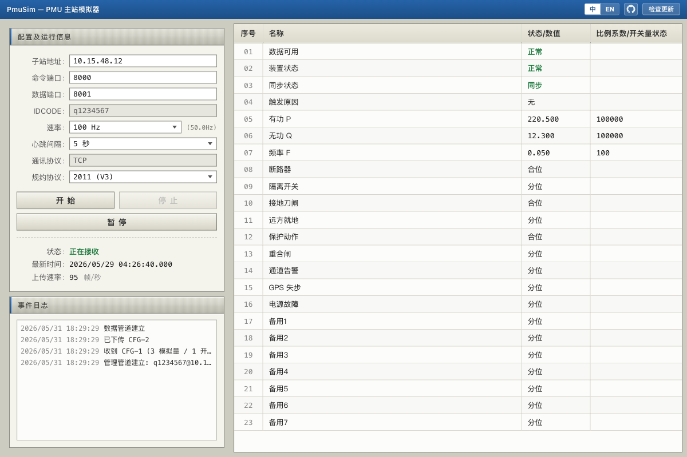

<div align="center">



[](https://github.com/Karl-Dai/PmuSim/releases)
[](https://github.com/Karl-Dai/PmuSim/releases)
[](https://github.com/Karl-Dai/PmuSim/stargazers)
[](LICENSE)
[]()

**跨平台 PMU 主站模拟器 — 一个桌面工具同时跑 Q/GDW 131-2006 (V2) 与 GB/T 26865.2-2011 (V3)。**

基于 **Rust** · **Tauri 2** · **Vue 3** — [English](README.md) · **中文**


</div>

---

## 运行效果



空闲 → **连接中** → **已连接** → 实时数据流。TCP 已连上但子站还没回 CFG-1 时,状态保持琥珀色「连接中」;只有真正收到 PMU 帧后才转绿「已连接」。

## 这是个什么项目

测试 PMU 主站通常两种痛苦:借一台真实子站,或跑一段半坏的脚本、还常常只支持一个版本的规约。PmuSim 把完整的主站装进桌面端:

- 📡 **两个规约版本共用一个二进制** — Q/GDW 131-2006 (V2) 与 GB/T 26865.2-2011 (V3),帧格式与端口差异都已对齐。
- 🤝 **TCP 角色按规约正确** — 管理通道主站作 client;V3 数据通道主站作 client,V2 数据通道主站作 server。
- 🌐 **多子站同时接入** — 主站可同时接入多台子站,侧栏按 IDCODE / FPS / 状态 LED 列出,点击切换聚焦;通信日志 / 配置 / 数据帧 / 帧率 / 时钟偏差 / 重连全部按子站隔离。
- 🧭 **相量可视化** — 数据面板内嵌极坐标相量图,按 CFG-2 FORMAT 位自动解析极/直角坐标,逐通道实时画出幅值与角度;数据表新增系统频率、ROCOF 及每个相量通道的读数行。
- ⚡ **一键握手** — `CFG-1 → CFG-2 命令 → CFG-2 → 召唤 CFG-2 → 启动数据`,带 ACK/NACK 等待,全流程自动化。
- 🔄 **应用内自动更新** — ed25519 签名安装包,4 路 endpoint 回退(国内 3 个镜像 + GitHub)。
- 🪶 **小体积原生** — Rust + Tauri 2;没 JVM、没 Python runtime、没 Electron。

## 快速上手

1. **选规约 (V2 / V3)。** 默认目标 `10.15.48.12 : 8000` 可改。
   <br>
2. **填子站地址与端口。** 数据端口自动跟随命令端口(可改)。
   <br>
3. **点 开始,再点 连接。** 子站回应后状态从 连接中 → 已连接,IDCODE 落入只读字段。
   <br>
4. **看数据表填充** — CFG-2 通道名、模拟量比例系数、开关量标签;上传速率显示实时帧率。
   <br>

## 下载

预编译安装包在 **[Releases 页面](https://github.com/Karl-Dai/PmuSim/releases)**,每个文件都做了 minisign 签名,应用内更新器验签后才安装。

| 平台    | 安装包 |
|---------|--------|
| Windows | x64: `PmuSim_<ver>_x64-setup.exe` (NSIS) · `PmuSim_<ver>_x64_en-US.msi` — ARM64: `PmuSim_<ver>_arm64-setup.exe` (NSIS) |
| macOS   | `PmuSim_<ver>_aarch64.dmg` (Apple Silicon) · `PmuSim_<ver>_x64.dmg` (Intel) |
| Linux   | `PmuSim_<ver>_amd64.AppImage` · `PmuSim_<ver>_amd64.deb` · `PmuSim-<ver>-1.x86_64.rpm` |

v0.3.0 起支持应用内自动更新;旧版本先手动装一次 v0.3.0+,之后更新器接管。macOS 首次启动需要[一步操作](#macos-首次启动)。

**国内镜像**(GitHub 访问可能不稳):<https://ghfast.top/https://github.com/Karl-Dai/PmuSim/releases/latest>。v0.3.0 起更新器自动在多个 proxy 间回退;但从无更新器的旧版**首次升级**,需先通过镜像装一次。

## 从源码构建

前置:[Rust](https://rustup.rs/) 1.77+、[Node.js](https://nodejs.org/) 18+、Tauri CLI(`cargo install tauri-cli --version '^2'`)、[Tauri 2 系统依赖](https://v2.tauri.app/start/prerequisites/)。

```bash
cd frontend && npm install          # 一次性
cd ../crates/pmusim-app && cargo tauri dev   # dev
cargo tauri build                    # 生产构建
```

`cargo test --workspace` 跑核心协议测试(帧解析、CRC、时间工具 round-trip)。

## 规约支持

<details>
<summary><b>帧类型、命令、通道方向、V2 vs V3</b></summary>

### 帧类型

| SYNC   | 帧类型 | 方向                    |
|--------|--------|-------------------------|
| 0xAA0x | 数据帧 | 子站 → 主站 (数据通道)  |
| 0xAA2x | CFG-1  | 子站 → 主站 (管理通道)  |
| 0xAA3x | CFG-2  | 双向 (管理通道)         |
| 0xAA4x | 命令帧 | 主站 → 子站 (管理通道)  |

### 命令

| 代码   | 命令          | 说明                    |
|--------|---------------|-------------------------|
| 0x0001 | 关数据        | 停止实时数据流          |
| 0x0002 | 开数据        | 启动实时数据流          |
| 0x0004 | 请求 CFG-1    | 请求配置帧 1            |
| 0x0005 | 请求 CFG-2    | 请求配置帧 2            |
| 0x4000 | 心跳          | 保活心跳                |
| 0x8000 | 发 CFG-2 通知 | 通知子站即将下发 CFG-2  |

### 通道方向

| 通道 | 主站角色 (V2) | 主站角色 (V3) | V2 端口 | V3 端口 |
|------|---------------|---------------|---------|---------|
| 管理 | client        | client        | 7000    | 8000    |
| 数据 | server        | client (外联) | 7001    | 8001    |

### V2 vs V3 差异

| 特性             | V2 (2006)            | V3 (2011)            |
|------------------|----------------------|----------------------|
| 管理端口         | 7000                 | 8000                 |
| 数据端口         | 7001                 | 8001                 |
| IDCODE 长度      | 2 字节               | 8 字节 (ASCII)       |
| 帧头字段顺序     | SYNC-SIZE-SOC-IDCODE | SYNC-SIZE-IDCODE-SOC |
| 数据帧带 IDCODE  | 否                   | 是                   |
| 时间质量         | 4-bit                | 8-bit                |
| 数据通道主站角色 | server               | client               |

</details>

## 项目结构

```
PmuSim/
├── crates/
│   ├── pmusim-core/      # 协议库 (无 Tauri 依赖)
│   ├── pmusim-app/       # Tauri 桌面应用 (主站)
│   └── pmusim-sub/       # Tauri 桌面应用 (子站模拟器)
├── frontend/             # Vue 3 + TypeScript SPA (主站)
├── frontend-sub/         # Vue 3 + TypeScript SPA (子站)
├── scripts/              # release 脚本 (updater manifest、release notes)
└── .github/workflows/    # CI: release.yml (签名 + 发布)
```

| 层     | 技术栈                                                           |
|--------|------------------------------------------------------------------|
| 后端   | Rust, [tokio](https://tokio.rs/) (async TCP), `encoding_rs` (GBK) |
| 前端   | Vue 3, TypeScript, Vite                                          |
| 桌面层 | [Tauri 2](https://tauri.app/) + `tauri-plugin-updater`           |

## 常见问题 / 故障排查

<details>
<summary><b>状态显示「已连接」但数据表一直空 / 上传速率为 0</b></summary>

状态分两种:**连接中**=TCP 已连上但子站还没回 CFG-1;**已连接**=已收到真实 PMU 帧。若看到琥珀色「连接中」加事件日志 `CFG-1 not received after request`,说明命令端口的 TCP 能连上、但后面没有真正说 PMU 协议的服务——检查子站的命令服务是否真的起在那个端口上。
</details>

<details>
<summary><b>macOS:「PmuSim 无法打开 — Apple 无法验证…」</b></summary>

安装包是 ad-hoc 签名(未公证)。一次性放行步骤见 [macOS 首次启动](#macos-首次启动)。
</details>

<details>
<summary><b>国内下载 GitHub 慢或被墙</b></summary>

用[下载](#下载)里的国内镜像;v0.3.0 起更新器也会自动走 proxy 回退。
</details>

<details>
<summary><b>数据端口由哪一端 bind?</b></summary>

V2:主站是数据通道**服务端**,在本地 bind 侦听端口(默认命令端口+1)。V3:主站是**客户端**,外连子站的远程数据端口。UI 会按规约命名该字段并隐藏无关项。
</details>

## 路线图

`docs/TODO.md` 里的 V3 规约符合性条目已全部完成:FORMAT 标志位解码(浮点/直角坐标)、多 PMU 配置帧、CFG-2 ACK/NACK 等待、心跳超时加固、STAT bit10 配置变更重握手、ANUNIT 类型字节掩码、GPS 时间质量解码、IDCODE 原字节保留、OpenData 状态门控。剩余:lab 子站数据源(IEMP pipeline)目前发全 0 采样——属子站侧问题,记录在 `docs/TODO.md`。欢迎通过 issue 提新想法与现场反馈。

## 参与贡献

1. 大改动前先开 issue 说明 bug / 需求。
2. 从 `main` 拉分支,PR 保持聚焦。
3. 提 PR 前跑 `cargo test --workspace` 和 `cd frontend && npm run build`,两者都要通过。
4. **提交署名:** 所有 commit 作者必须为 `Karl-Dai Karl <kelsoprotein@gmail.com>`,**禁止** AI co-author 或任何生成署名行。

## 子站模拟器 (`pmusim-sub`)

`pmusim-sub` 是一个独立的 Tauri 应用, 扮演 PMU **数据发送方**的角色 — 与主站 PmuSim 对标。可用来在没有真实子站的情况下开发和测试主站。

**规约支持** — 同时支持 V2 (Q/GDW 131-2006) 与 V3 (GB/T 26865.2-2011), 完整命令响应握手: 响应 CFG-1 / CFG-2 请求, 接收「下传 CFG-2」命令, 执行打开/关闭数据、心跳、触发帧。

**数据生成** — 各通道可独立配置正弦相量输出: 幅值、初相角、系统频率偏移 Δf 及 ROCOF。模拟量和开关量也可设置静态值。

**TCP 角色 (与主站镜像)**

| 通道   | 子站 TCP 角色 (V2)        | 子站 TCP 角色 (V3)        | 默认端口            |
|--------|---------------------------|---------------------------|---------------------|
| 管理   | server                    | server                    | V2 7000 / V3 8000   |
| 数据   | client (主动连主站)       | server (主站连入)         | V2 7001 / V3 8001   |

**从源码运行** (本版本暂无签名安装包 / 自动更新):

```bash
cd frontend-sub && npm install   # 一次性安装前端依赖
cd ../crates/pmusim-sub && cargo tauri dev
```

**本地互测** — 先启动 `pmusim-sub`, 再启动主站 PmuSim, 将主站目标地址指向子站:

- **V3**: 主站管理目标 → `127.0.0.1 : 8000`
- **V2**: 主站管理目标 → `127.0.0.1 : 7000`; 主站数据本地侦听端口 → `7001`

## macOS 首次启动

安装包**未经 Apple 公证**(没买 Developer Program)。首次启动 macOS 会弹「PmuSim 无法打开 — Apple 无法验证…」——应用**没有损坏**,这是对 ad-hoc 签名应用的常规拦截。

<details>
<summary><b>放行方法(二选一)</b></summary>

**1. GUI 路径** — 双击 `.app`,点「完成」;打开*系统设置 → 隐私与安全性*,滚到最下面,点「仍要打开」并输入密码;在下一个对话框点「打开」。之后启动不再被拦。

**2. 终端一行命令**

```bash
xattr -dr com.apple.quarantine "/Applications/PmuSim.app"
```

</details>

## 更新日志

完整版本历史见 [CHANGELOG.md](CHANGELOG.md),安装包下载见 [Releases](https://github.com/Karl-Dai/PmuSim/releases) 页面。

## 致谢

基于 [Tauri 2](https://tauri.app/)、[Vue 3](https://vuejs.org/)、[tokio](https://tokio.rs/)、[`encoding_rs`](https://github.com/hsivonen/encoding_rs) 与 `tauri-plugin-updater` 构建。协议行为遵循 GB/T 26865.2-2011 (V3) 与 Q/GDW 131-2006 (V2) 规约。

## 许可证

[MIT](LICENSE)
